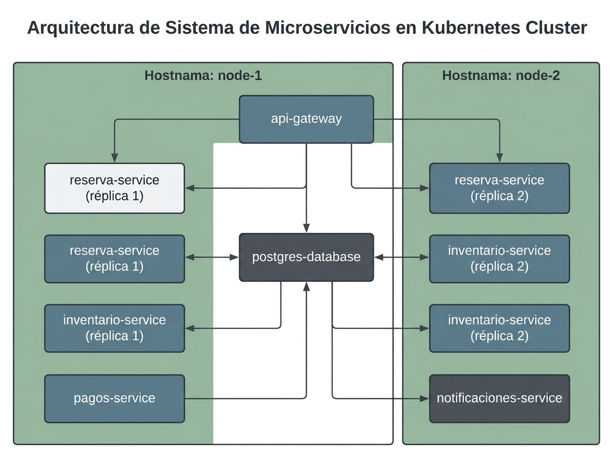
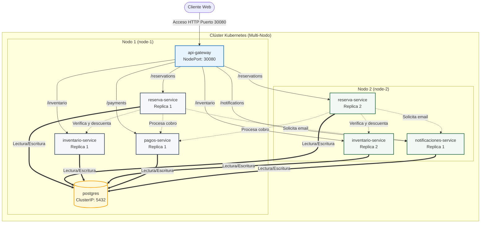

# Diagrama de Arquitectura y Distribución en Kubernetes

Este documento contiene la descripción y el diagrama de distribución de los 6 componentes de la aplicación entre los dos nodos del clúster de Kubernetes, cumpliendo con la directriz de tolerancia a fallos multi-nodo (con distribución de réplicas críticas usando anti-afinidad de pods).

---

## 1. Diagrama de Arquitectura Visual

A continuación se presenta el diagrama de arquitectura generado que detalla la topología de red, el flujo de llamadas de API y cómo se distribuyen los pods entre los dos nodos de cómputo del clúster:

---

## 2. Diagrama de Arquitectura en Mermaid

---

## 3. Detalles de Resiliencia en la Distribución de Pods

### Anti-Afinidad de Pods (Pod Anti-Affinity)
Para cumplir con la restricción de que **la caída de un nodo no elimine todas las réplicas del servicio crítico**, los manifiestos `reservacion.yaml` e `inventario.yaml` definen reglas de anti-afinidad:
- El planificador de Kubernetes (`kube-scheduler`) detecta que el pod `reserva-service` o `inventario-service` ya está corriendo en el `node-1`.
- Al planificar la segunda réplica, detecta la regla de exclusión y la asigna obligatoriamente al `node-2`.
- Si el `node-1` sufre un fallo de hardware (crash) y queda inaccesible:
  - El `api-gateway` detectará el fallo en las conexiones hacia el `node-1`.
  - El balanceador interno de Kubernetes redirigirá el 100% de las solicitudes de reserva e inventario a las réplicas activas en el `node-2`, manteniendo la disponibilidad del sistema.
